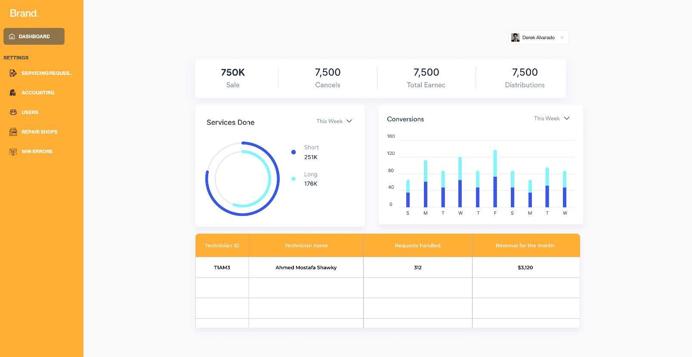
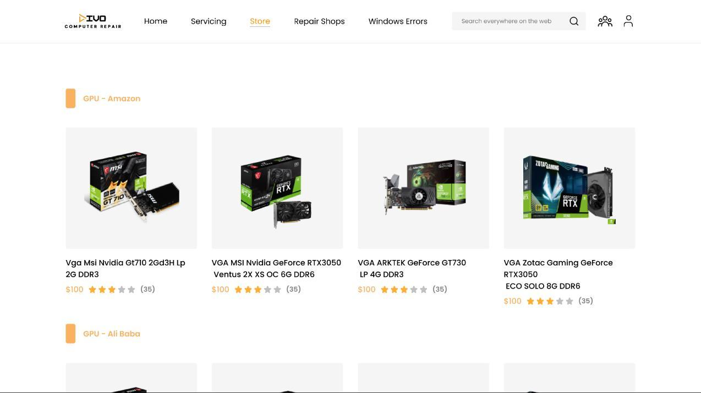
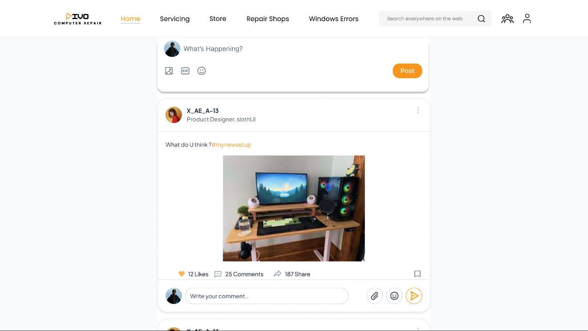

# TechSupport Platform

TechSupport Platform is a full-stack computer maintenance and technical support solution designed to combine user-facing web workflows with backend support services in one repository.

## Project Overview

This repository contains two main application layers:
- `frontend/` — React-based single-page application for customers, technicians, and administrators.
- `backend/` — Node.js + Express API server that handles authentication, community features, help sessions, specialist management, scraping services, Windows error tracking, file uploads, and notifications.

## Core Features

- Secure user registration, login, and profile management
- Community discussion boards with posts and comments
- Online help session booking and technician request management
- Specialist support workflows for computer repair professionals
- Product scraping from multiple e-commerce stores
- Windows error tracking, reporting, and troubleshooting guidance
- Image and video upload handling for service requests and support cases
- Dedicated admin and technician dashboards for management and reporting

## Design Previews

The `Design-Images/` folder contains visual references for the application's user experience. These images show key screens from the design prototype and help communicate the intended UI layout.






## Installation

1. Install backend dependencies:
   ```bash
   cd backend
   npm install
   ```

2. Install frontend dependencies:
   ```bash
   cd ../frontend
   npm install
   ```

## Configuration

Create local configuration files before running the application. These files are intentionally excluded from version control:

- `backend/.env`
- `backend/cloudinaryInfo.txt`
- `backend/config/firebaseServiceAccount.json`
- TLS certificates stored under `backend/certs/`
- Uploaded files under `backend/uploads/`

## Running the Application

Start both services separately. For example:

Backend:
```bash
cd backend
npm start
```

Frontend:
```bash
cd frontend
npm start
```

Adjust the startup commands if your package scripts differ.

## Repository Structure

- `backend/` — API server, controllers, models, routes, middleware, and utility integrations
- `frontend/` — React application with pages, components, contexts, hooks, and protected routes
- `Design-Images/` — Image assets for UI design and project presentation
- `RELEASE_NOTES.md` — Project release notes and summary of changes

## Contribution Guidelines

- Use descriptive commit messages and preserve history when merging updates.
- Keep environment-specific files and secrets out of source control.
- Test both frontend and backend changes before pushing.

## Notes

Sensitive or environment-specific files are ignored in this repository, including:
- `backend/certs/`
- `backend/config/`
- `backend/node_modules/`
- `backend/uploads/`
- `backend/.env`
- `backend/cloudinaryInfo.txt`

## License

Include your chosen license here if applicable.
